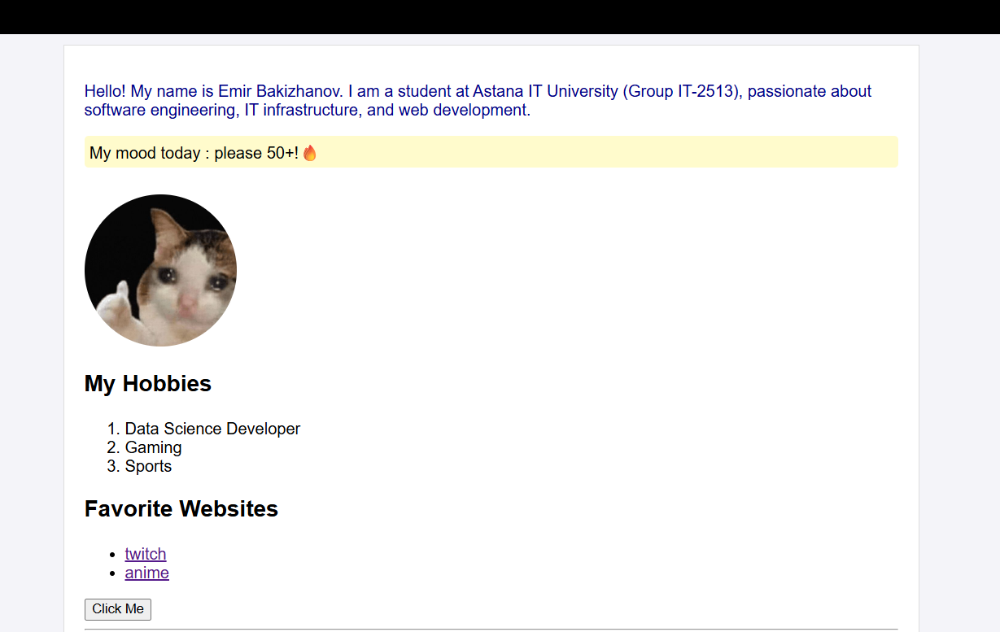

# Assignment 1 Personal Profile Page

**Student:** Emir Bakizhanov  
**Group:** IT-2513  
**Course:** WEB

## About
My first project for WEB , i try made this first project clearly

## Project Structure
- `index.html` - Main webpage
- `home.html` -Copy of main page
- `style.css` - Styles sheet
- `image.png` - My profile photo
- `README.md` - Project info
- `screenshots/` - Page screenshots

## Screenshot

